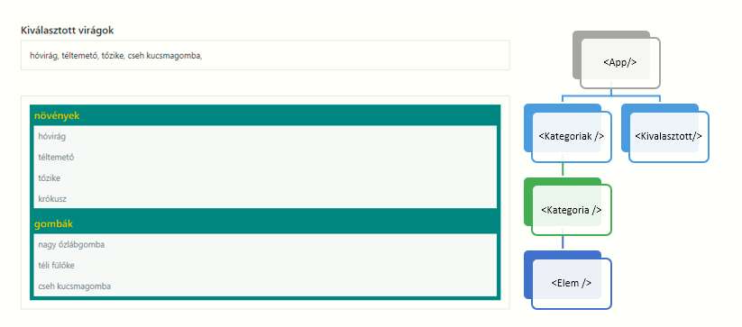
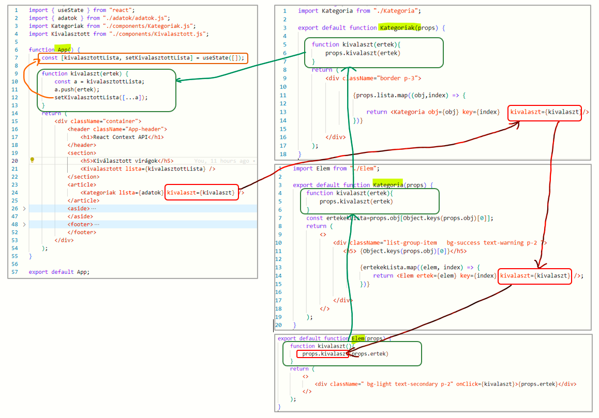
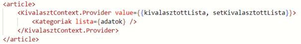
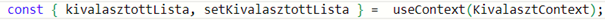
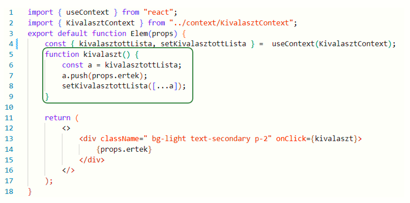
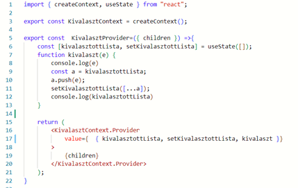
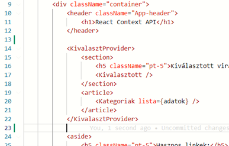
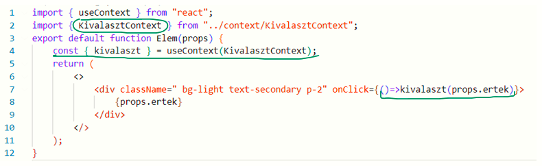
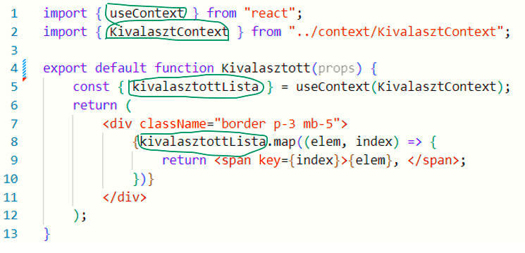
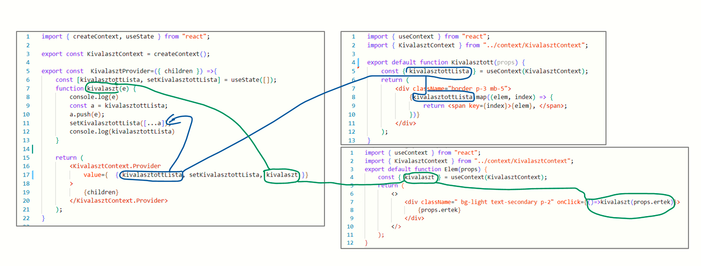

# React Context API

Pages link: https://csefikatalin.github.io/context-api/

## Egymásba ágyazott komponensek és a Props láncolat

A Reactban a state -ek azok az objektumok, melyek leírják a program állapotát. A state-ek értékeit a props objektumon keresztül juttathatjuk el a gyerek komponensekhez.

Azonban ez a folyamat hosszú is lehet, ha több, egymásba ágyazott komponensen keresztül kell az értéket leküldeni, majd onnan a gyerek komponens visszabuborékoltatja a legfelső szintre a state változtatásának kérését, megint csak egy hosszú láncon keresztül.

## Nézzük az alábbi példát:

Itt az App komponens a Kategoriak->Kategoria->Elem komponens soron keresztül buborékoltatja le az adatokat a propson keresztül. Amikor rákattintunk egy elemre, akkor a kiválasztott tétel neve megjelenik egy listában. Ez a listát megint csak az App komponens adja át a Kivalasztott komponensnek.

Az alábbi jobb oldali ábrán látszik a komponenshierarchia.

Az **App** komponens fogja módosítani azt a state-t a kivalaszt függvényében, amit a **Kivalasztott** komponens jelenít majd meg. Ehhez azonban az kell, hogy az Elem komponens tudja, hogy az App **kivalaszt** függévényét kell meghívnia, ha rákattintunk az elemre. Ehhez a teljes Kategoriak -> Kategoria -> Elem láncon végig kell buborékoltatni a propsokon keresztül az információt (piros nyilak), majd visszafelé a függvényhívásokon keresztül vissza kell juttatni az adatot (zöld nyilak).

**Nem lehetne ezt egyszerűbben, kihagyva ezt a hosszú láncolatot? **

**Épp ezt a problémát hidalja át a Context API. **

## Context API

A REACT Context API lehetővé teszi a komponensek közötti adatátvitelt az egész komponensfa hierarchiájában anélkül, hogy közvetlenül props-okon keresztül kellene átadni az adatokat. Ez a funkció különösen hasznos azokban az esetekben, amikor az alkalmazás állapotának vagy beállításainak globális elérést szeretnénk biztosítani a komponensek számára, vagy ha egy alkomponens által elérhető adatokat szeretnénk átadni több szülőkomponensnek.

### A context API-nak két fő eleme van: 

1.	**Provider**: Ez a komponens tartalmazza az adatokat, amelyeket más komponensek szeretnének használni. A Provider az adatokat egy Context-be helyezi el, és rendelkezésre teszi azokat az alatta lévő komponensek számára.
2.	**useContext hook** (vagy Consumer ): Ez a mechanizmus, amely lehetővé teszi a komponensek számára, hogy hozzáférjenek az adatokhoz, amelyeket a Provider rendelkezésre bocsátott. 

### Használata lépésről lépésre

1. Hozzunk létre egy context mappát és hozzuk létre egy fájlt KivalasztContext néven  (nem kötelező, csak szokás).  A beírandó kód:
       
    import { createContext } from "react";
    export const KivalasztContext=createContext("")

2. Az App.js-ben importáljuk be a KivalasztContext contextünket.

    import { KivalasztContext } from "./context/KivalasztContext.js";

Adjuk meg, hogy mely komponensekben akarjuk használni az itt definiált Context-e, azaz öleljük körbe a komponens egy Providerrel.
Itt kell a value attributumban megadni, hogy milyen változókhoz engedünk hozzáférést. Jelen esetben a  state-ben megadott változókat fogja ez jelenteni.

 
3. Az Elem komponensben, azaz a hívási lánc végén álló komponensben dolgozunk a továbbiakban:  importáljuk ide is a KivalasztContext-et, és a useContext Hook-ot.

A useContext Hook egy objektummal tér vissza, mely tartalmazza azokat a változókat, amelyeket definiáltunk a Context-ben.

 
4. Ezután már kitörölhetjük az összes felsőbb komponensláncból  a kivalaszt függvényeinket (a fenti képen zölddel jelölve) és a hozzá tartozó props láncolatot ( a fenti képen pirossal jelölve), mert most az Elem komponensben már közvetlenül meg tudjuk hívni a state változtatását.

Az Elem komponensünk most így fog kinézni:

## Providerek használata

Az előzőekben elkerültük  a propsok láncolását, ámde még mindig több helyen kezeljük az egyes változók állapotának változtatását. 

A Provider használatával   az alkalmazás állapotának vagy beállításainak globális elérést tudjuk biztosítani a komponensek számára.

Alakítsuk tovább a KivalasztContext.js-t

1.	lépés:  Hozzuk létre a kivalasztContext.js fájlban a KivalasztProvidert is.

    import { createContext, useState } from "react";
    export const KivalasztContext = createContext();

    export const  KivalasztProvider=({ children }) =>{
        
        return (
            <KivalasztContext.Provider
                value={{}}
            >
                {children}
            </KivalasztContext.Provider>
        );
    }

2.	lépés: Az App komponensbe importáljuk be a KivalasztProvidert. 
    import { KivalasztProvider } from "./context/KivalasztContext.js";

3.	lépés: Az Elem komponensből emeljük be a Providerbe a **stat**-et, és a **kivalaszt** függvényt. 
4.	lépés: A Provider **value** objektumában adjuk meg azokat a változókat, amelyeket a komponensekben használni akarunk. Most így néz ki a KivalasztContext.

5.	lépés: Öleljük körbe a KivalasztProvider komponenssel azokat a részeket, amikben olyan változókat használunk, amiket globálisan akarunk kezelni. Ez most két komponenst jelent: A Kivalasztott komponenst és a Kategoriak komponenst. 

6.	Az Elem komponensben használjuk a Providerben megadott kivalaszt paramétert. Ez az a függvény, amit a kattintáskor le akarunk futtatni. 

7.	A Kivalasztott kompnensben pedig a kivalasztottLista értékeit jelenítjük meg, így ezt a változót kell elérhetővé tenni. 

**Így már a providerben egy helyen kezelhetjük a változókat és a függvényeket, melyeket felhasználhatunk a komponenshierarchia bármely pontján. **

